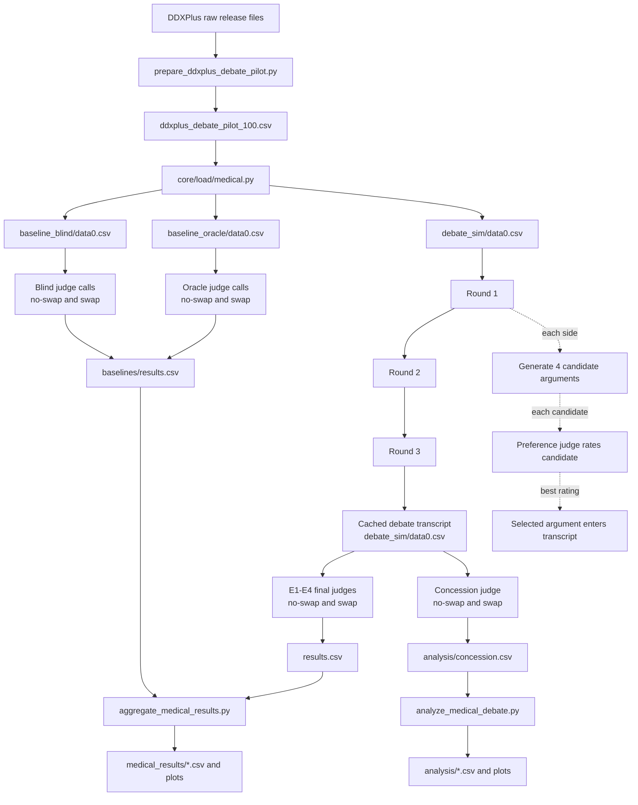

# Medical Debate

**Can AI debate help a weaker judge choose the right medical diagnosis?**

This repository is a work-in-progress research fork of
[`ucl-dark/llm_debate`](https://github.com/ucl-dark/llm_debate), the codebase
released with Khan et al. (2024), *Debating with More Persuasive LLMs Leads to
More Truthful Answers*. The original paper tested AI debate on hard reading
comprehension questions. This fork adapts that setup to synthetic clinical
differential diagnosis.

The project is being developed as part of the BlueDot Impact Technical AI
Safety Sprint, with API spend supported by a BlueDot grant.

This is not a medical product and it is not a diagnostic system. It is a small
AI safety experiment about oversight: whether argument and counterargument can
help a less capable judge notice which answer is better supported by hidden
evidence.

## The Idea

As AI systems become more capable, humans and smaller models will increasingly
need to supervise answers they cannot fully verify from scratch. Medicine is a
natural example: a powerful model might read a patient record quickly and
suggest a diagnosis, while the reviewer has limited time and expertise.

AI debate is one proposed oversight method. Instead of asking a judge to solve
the whole problem alone, two models argue for different answers. The judge then
evaluates the arguments. If the correct side can point to concrete evidence and
the incorrect side can be challenged, debate may make the truth easier to
recognize.

This project asks whether that idea transfers from short-story comprehension to
medical diagnosis:

> Does AI debate improve blind judging in synthetic differential diagnosis from
> structured symptom and antecedent evidence?

The exciting part is the asymmetry. The debaters get access to the patient
evidence. The judge may not. If debate helps anyway, it suggests a practical
direction for supervising systems whose full reasoning context is too large or
too costly for every reviewer to inspect directly.

## What The Experiment Tests

Each case gives two possible diagnoses:

- the true DDXPlus pathology
- a plausible alternative from the case's own differential diagnosis list

Two debaters see the structured patient evidence and argue opposing diagnoses.
A judge then chooses between the diagnoses. The main study compares four debate
conditions:

| Condition | Debaters | Judge | Judge sees evidence? |
|---|---|---|---|
| E1: Information asymmetry | Frontier model | Same frontier model | No |
| E2: Double asymmetry | Frontier model | Weaker model | No |
| E3: Capability asymmetry | Frontier model | Weaker model | Yes |
| E4: Full symmetry | Frontier model | Same frontier model | Yes |

The headline condition is **E2**, where a weaker judge must evaluate arguments
from stronger debaters without seeing the evidence directly. That is the most
realistic oversight setting.

The planned model families are:

| Family | Frontier debaters / frontier judge | Weaker judge and headline baselines |
|---|---|---|
| OpenAI | `gpt-5.5` | `gpt-5.4-mini` |
| Anthropic | `claude-opus-4-7` | `claude-sonnet-4-6` |

E1 and E4 use the frontier model as judge. E2 and E3 use the weaker model as
judge. The main blind/oracle baseline comparison is run with the weaker judge,
because that is the headline oversight setting. To compute same-judge PGR for
E1 and E4 as well, run matching frontier-judge baselines in the same baseline
directory.

The experiment also runs blind and oracle baselines:

- **Blind baseline:** judge sees only the question and two diagnoses.
- **Oracle baseline:** judge sees the question, diagnoses, and patient evidence.

Those baselines define the floor and ceiling used to compute Performance Gap
Recovered, following Khan et al.

Each debate is three rounds with a 150-word limit per debater per round. Debaters
can cite the structured evidence using `<quote>` tags; quotes are verified
against the patient evidence before the judge sees the transcript. Judging is
run with answer letters swapped to reduce simple A/B positional bias.

## Methodology

The pipeline has three layers: dataset preparation, transcript generation, and
judging/analysis. The diagram below shows the main API-bearing path for one
model family.



### Dataset Preparation

`scripts/prepare_ddxplus_debate_pilot.py` rebuilds the 100-case pilot from the
DDXPlus release files. The selection is deterministic rather than a simple
random sample: it keeps adult, evidence-rich cases where the true pathology and
a plausible distractor are close in the DDXPlus differential distribution, then
round-robins across pathologies. The A/B position of the true diagnosis is
randomized with a fixed seed so the pilot is reproducible.

`core/load/medical.py` converts that prepared pilot into the internal experiment
schema expected by the inherited debate machinery. That is why the run creates
working files such as `baseline_blind/data0.csv` and `debate_sim/data0.csv`
rather than writing directly into the source dataset.

### Baselines

The blind and oracle baselines are run before or alongside debate so later
analysis can be regenerated without repeating API calls. The baseline runner
creates:

- `baseline_blind/data0.csv` and `baseline_oracle/data0.csv`: working files with
  the cases and zero-round transcripts.
- `baseline_blind/<judge>/data0_judgement.csv` and
  `baseline_oracle/<judge>/data0_judgement.csv`: judge outputs for the original
  A/B ordering.
- `baseline_blind/<judge>/data0_swap_judgement.csv` and
  `baseline_oracle/<judge>/data0_swap_judgement.csv`: judge outputs after A/B
  swap control.
- `baselines/results.csv`: appended scoring summaries.

The headline baselines use the weaker judge because the main oversight question
is whether debate helps a weaker supervisor. Matching frontier-judge baselines
can also be run if same-judge PGR is needed for E1 and E4.

### Debate Generation And BoN

For each debate case, the frontier model argues both sides for three rounds.
Each side uses `BoN=4` by default:

1. The debater generates four candidate arguments for its assigned diagnosis.
2. A preference judge evaluates each candidate by temporarily inserting that
   candidate into the current transcript and asking which answer, A or B, is
   more likely correct.
3. A candidate receives rating `1.0` if the preference judge chooses that
   debater's assigned side, `0.0` if it chooses the opposing side, and `0.5` if
   the response is unclear.
4. The candidate with the highest rating is selected for the transcript.

If multiple candidates tie for the highest rating, the current implementation
selects the first tied candidate returned by the model/API adapter. This is a
deterministic tie-break over the candidate order, not a second judging pass.

The preference judge is not the same as the final answer judge. It is an
internal selection mechanism used while constructing each debater's argument.
The final answer judges only run after the full transcript has been generated.

### Quote Verification

Debaters are instructed to cite evidence with `<quote>...</quote>` tags. Before
the transcript is shown to any judge, `core/transcript_parser.py` checks each
quote against the patient evidence using normalized exact substring matching.
Matched quotes are rewritten as `<v_quote>...</v_quote>` and unmatched quotes as
`<u_quote>...</u_quote>`. Judges are explicitly told to trust verified quotes
and distrust unverified quotes.

This quote check is deterministic code, not an extra model judge. The analysis
script later writes `analysis/quote_verification.csv` and
`analysis/plots/06_quote_verification.png` so fabricated or unmatched quote
rates can be inspected.

### Final Judging And Bias Controls

After transcript generation, the same cached debate is re-judged under E1-E4.
Each judgement is run twice: once in the original A/B order and once with the
answer letters swapped. This reduces simple positional bias and gives the
aggregator enough information to swap-average per-case correctness.

A separate concession judge is then run as a quality-control check. It does not
choose the diagnosis. Instead, it asks whether either debater broke the game by
arguing for the opposing side. The analysis script writes:

- `analysis/concession.csv`
- `analysis/plots/05_concession_rate.png`
- `analysis/debate_outcomes.csv`
- `analysis/plots/07_debate_outcomes.png`

The debate-outcomes plot gives the context needed for interpretation: how many
debates were usable, how many were flagged as concessions, and how many were
incomplete or missing concession judgement.

### Aggregated Outputs

`scripts/aggregate_medical_results.py` is a no-API analysis step. It rereads the
cached judgement CSVs and writes:

- `accuracy_by_condition.csv`: accuracy grouped by experimental condition
  (`B1`, `B2`, `E1`-`E4`), model family, and judge.
- `pgr_by_condition.csv`: Performance Gap Recovered relative to matching blind
  and oracle baselines.
- `per_case_lift.csv`: case-level debate accuracy joined to blind-baseline
  accuracy, useful for seeing which cases debate fixed or broke.
- `plots/01_accuracy_by_condition.png`
- `plots/02_pgr_by_condition.png`
- `plots/03_per_case_lift.png`

## Dataset

The current pilot uses **DDXPlus**, a public synthetic differential-diagnosis
dataset. Each case contains a patient age/sex, a presenting complaint, a true
pathology, a differential diagnosis distribution, and structured evidence such
as symptoms and antecedent risk factors.

This is deliberately not presented as real clinical chart review. DDXPlus is
synthetic and structured; it does not contain long notes, labs, imaging, or real
patient records. A positive result here would be evidence that the debate setup
is worth testing on richer clinical data later, not evidence that it is ready
for clinical use.

## Current Status

This repo is still in progress. The current artifact is a runnable experimental
harness, not a finished empirical result. The medical pipeline is wired up, but
the full 100-case experiment has not been completed yet.

What is currently in place:

- 100-case DDXPlus pilot dataset and loader
- medical debate prompts and baseline prompts
- four debate-condition configs
- OpenAI and Anthropic adapter code updated for the intended model families
- answer-letter swap judging to reduce positional bias
- quote verification for evidence cited by debaters
- scoring, aggregation, bias-control, transcript-export, and cost-summary scripts
- regression tests for answer parsing

What is still pending:

- full 100-case runs across the planned model families
- final baseline/debate result tables
- final plots and write-up
- additional validation on any model/API behavior that changes during the run

No final empirical conclusion should be inferred from the repository yet.

## What This Fork Adds

Compared with the upstream debate codebase, this fork adds the pieces needed to
run the medical oversight experiment end to end:

- [`core/load/medical.py`](core/load/medical.py) converts the DDXPlus pilot CSV
  into the internal question schema.
- [`core/config/experiment/`](core/config/experiment/) contains the medical
  baseline and E1-E4 debate configs.
- [`core/config/experiment/debaters/medical_v1.yaml`](core/config/experiment/debaters/medical_v1.yaml)
  contains the medical debater prompt.
- [`scripts/prepare_ddxplus_debate_pilot.py`](scripts/prepare_ddxplus_debate_pilot.py)
  rebuilds the pilot CSV from the raw DDXPlus release files.
- [`scripts/run_medical_baselines.sh`](scripts/run_medical_baselines.sh) runs
  blind and oracle baselines.
- [`scripts/run_medical_debate.sh`](scripts/run_medical_debate.sh) runs debate
  generation and re-judges the cached transcripts across E1-E4.
- [`scripts/aggregate_medical_results.py`](scripts/aggregate_medical_results.py)
  aggregates cached results into accuracy tables and, once matching baselines
  exist, PGR and per-case lift tables.
- [`scripts/analyze_medical_debate.py`](scripts/analyze_medical_debate.py)
  summarizes verbosity, quote verification, and concession checks.
- [`tests/test_accuracy.py`](tests/test_accuracy.py) pins answer-parsing edge
  cases discovered during smoke testing.

The QuALITY-era human-trial web app, tournament scripts, and unrelated upstream
analysis tooling have been removed so this fork stays focused on the medical
experiment.

## Quickstart

```bash
virtualenv --python python3.11 .venv
source .venv/bin/activate
pip install -r requirements.txt

# Secrets live in a top-level SECRETS file:
# API_KEY=<openai-key>
# ANTHROPIC_API_KEY=<anthropic-key>
# DEFAULT_ORG=

# No API calls: sanity-check scoring.
make test

# Rebuild the prepared DDXPlus pilot if raw DDXPlus files are available locally.
python scripts/prepare_ddxplus_debate_pilot.py

# API calls: small baseline smoke using the OpenAI weaker judge (`gpt-5.4-mini`).
./scripts/run_medical_baselines.sh 5 exp/medical_debate_smoke/baselines openai

# API calls: small debate smoke on the OpenAI family. Aggregation reads the
# matching baselines directory for PGR and per-case lift.
./scripts/run_medical_debate.sh 1 exp/medical_debate_smoke openai exp/medical_debate_smoke/baselines
```

Use `anthropic` as the third argument to run the Anthropic family instead. The
baseline runner defaults to the weaker judge for that family: `gpt-5.4-mini` for
OpenAI and `claude-sonnet-4-6` for Anthropic. The debate runner uses the
frontier/weak pair shown in the model-family table above, unless `FRONTIER` or
`WEAKER` are explicitly overridden in the environment.

Full experiment runs are intentionally left out of the quickstart because they
consume API credits and should only be launched once keys, quotas, and output
directories have been checked.

Generated experiment outputs are written under `exp/`, which is intentionally
gitignored.

## Relationship To Upstream

This is a focused research fork of `ucl-dark/llm_debate`. The original codebase
provided the debate framework, rollouts, judge/debater abstractions, scoring
patterns, and the inspiration for the experimental design. This fork strips out
much of the QuALITY/human-trial tooling and adds the medical dataset pipeline,
medical prompts, updated model adapters, and analysis scripts for the DDXPlus
experiment.

The upstream paper is included as [`paper.pdf`](paper.pdf).

## Acknowledgements

This work is part of the
[BlueDot Impact Technical AI Safety Sprint](https://bluedot.org/), a six-week
programme in which participants extend recent AI safety work into a small
original project. I am grateful to BlueDot for the programme structure,
mentorship, and grant funding for API credits.

## Citation

Base codebase and original debate result:

```bibtex
@misc{khan2024debating,
  title={Debating with More Persuasive LLMs Leads to More Truthful Answers},
  author={Akbir Khan and John Hughes and Dan Valentine and Laura Ruis and Kshitij Sachan and Ansh Radhakrishnan and Edward Grefenstette and Samuel R. Bowman and Tim Rocktäschel and Ethan Perez},
  year={2024},
  eprint={2402.06782},
  archivePrefix={arXiv},
  primaryClass={cs.AI}
}
```

DDXPlus dataset:

```bibtex
@inproceedings{tchango2022ddxplus,
  title={DDXPlus: A New Dataset For Automatic Medical Diagnosis},
  author={Tchango, Arsene Fansi and Goel, Rishab and Wen, Zhi and Martel, Julien and Ghosn, Joumana},
  booktitle={Advances in Neural Information Processing Systems Datasets and Benchmarks Track},
  year={2022}
}
```

This fork is licensed under the same MIT licence as upstream. See
[`LICENSE`](LICENSE).
