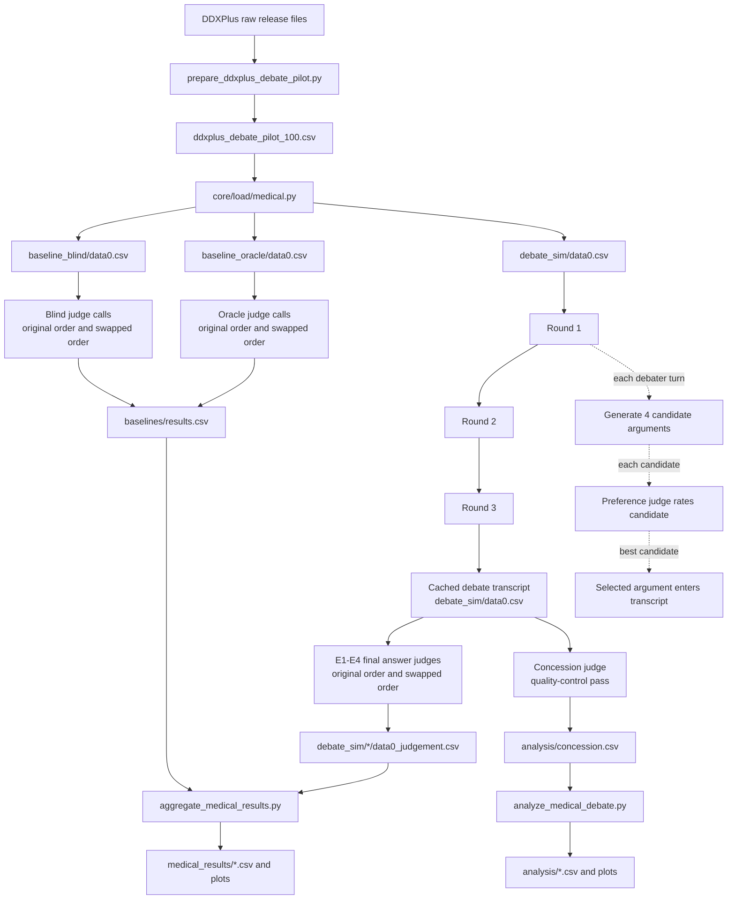

# Medical Debate

**Can AI debate help a weaker judge choose the right medical diagnosis?**

This repository is a work-in-progress research fork of
[`ucl-dark/llm_debate`](https://github.com/ucl-dark/llm_debate), the codebase
released with Khan et al. (2024), *Debating with More Persuasive LLMs Leads to
More Truthful Answers*. The original paper studied debate on hard reading
comprehension questions. This fork adapts the same broad oversight idea to
synthetic medical differential diagnosis.

The core question is whether debate can make hidden evidence easier to judge.
Each case has two candidate diagnoses: the true DDXPlus pathology and a
plausible distractor from that case's differential diagnosis list. Two debaters
argue opposite sides while seeing the structured patient evidence. A judge then
chooses between the diagnoses, sometimes without seeing the evidence directly.

This is not a medical product and it is not a diagnostic system. It is an AI
safety experiment about oversight: can argument and counterargument help a less
capable supervisor identify the answer that is better supported by evidence it
may not inspect directly?

The project is being developed as part of the BlueDot Impact Technical AI
Safety Sprint, with API spend supported by a BlueDot grant.

## Methodology

### Research Question

The experiment asks:

> Does AI debate improve blind judging in synthetic differential diagnosis from
> structured symptom and antecedent evidence?

The headline oversight setting is **E2: double asymmetry**. In that condition,
stronger debaters see the patient evidence and argue both sides, while a weaker
judge evaluates the transcript without seeing the evidence. If this improves on
a blind baseline, debate may be recovering some of the value of hidden evidence
without requiring the judge to inspect the full record.

### Dataset

The current pilot uses **DDXPlus**, a public synthetic differential-diagnosis
dataset. Each case contains patient demographics, an initial complaint, a true
pathology, a differential diagnosis distribution, and structured evidence such
as symptoms and antecedent risk factors.

The committed pilot file is:

```text
data/ddxplus/ddxplus_debate_pilot_100.csv
```

The pilot can be rebuilt from local DDXPlus release files with:

```bash
python scripts/prepare_ddxplus_debate_pilot.py
```

The 100 cases are not a simple random sample. The preparation script:

1. Reads the DDXPlus test-patient file and evidence definitions.
2. Keeps adult cases only.
3. Requires a non-true diagnosis in the differential list to use as a plausible
   distractor.
4. Keeps evidence-rich cases with at least 20 evidence items.
5. Requires both the true pathology and the distractor to have probability at
   least `0.05`.
6. Requires the true-vs-distractor probability gap to be no larger than `0.10`.
7. Sorts by smallest probability gap, then higher evidence count, then original
   source row order.
8. Selects cases round-robin across pathologies so the pilot is not dominated by
   one condition.
9. Randomizes whether the true diagnosis appears as diagnosis A or diagnosis B
   with fixed seed `20260504`.

This deliberately emphasizes difficult two-choice cases where the distractor is
plausible according to DDXPlus. The raw DDXPlus patient release files are not
redistributed through this repository; generated experiment outputs are also
excluded from Git.

### Experimental Arms

Each case is evaluated through blind/oracle baselines and four debate
conditions.

| Arm | Description | Debaters | Judge | Judge sees evidence? |
|---|---|---|---|---|
| B1 | Blind baseline | None | Weaker judge | No |
| B2 | Oracle baseline | None | Weaker judge | Yes |
| E1 | Information asymmetry | Frontier model | Same frontier model | No |
| E2 | Double asymmetry | Frontier model | Weaker model | No |
| E3 | Capability asymmetry | Frontier model | Weaker model | Yes |
| E4 | Full symmetry | Frontier model | Same frontier model | Yes |

The baselines define the floor and ceiling for Performance Gap Recovered
(`PGR`):

```text
PGR = (debate_accuracy - blind_accuracy) / (oracle_accuracy - blind_accuracy)
```

The main baseline comparison uses the weaker judge because the central question
is whether debate helps a weaker supervisor. If same-judge PGR is needed for E1
and E4, run matching frontier-judge baselines as well.

### Model Families

The planned model families are:

| Family | Frontier debaters / frontier judge | Weaker judge and headline baselines |
|---|---|---|
| OpenAI | `gpt-5.5` | `gpt-5.4-mini` |
| Anthropic | `claude-opus-4-7` | `claude-sonnet-4-6` |

E1 and E4 use the frontier model as final judge. E2 and E3 use the weaker model
as final judge. The OpenAI weaker judge is `gpt-5.4-mini`; the Anthropic weaker
judge is `claude-sonnet-4-6`.

### Pipeline

The main API-bearing path for one model family is:



The pipeline has three important persistence points:

- `data/ddxplus/ddxplus_debate_pilot_100.csv` is the source pilot dataset.
- `exp/.../data0.csv` files are working files created by the inherited debate
  machinery. They cache baseline rows and full debate transcripts.
- `exp/.../*_judgement.csv`, `results.csv`, `analysis/`, and
  `medical_results/` are downstream outputs that can be re-read without
  repeating API calls.

### Baseline Runs

Baselines are run before debate so that analysis can compare debate against a
blind floor and oracle ceiling.

The baseline runner creates:

- `baseline_blind/data0.csv`: zero-round working rows for the blind baseline.
- `baseline_oracle/data0.csv`: zero-round working rows for the oracle baseline.
- `baseline_blind/<judge>/data0_judgement.csv`: blind judgements in original
  A/B order.
- `baseline_blind/<judge>/data0_swap_judgement.csv`: blind judgements after A/B
  answer swap.
- `baseline_oracle/<judge>/data0_judgement.csv`: oracle judgements in original
  A/B order.
- `baseline_oracle/<judge>/data0_swap_judgement.csv`: oracle judgements after
  A/B answer swap.
- `baselines/results.csv`: scoring summaries appended by
  `core.scoring.accuracy`.

The `data0.csv` files are not final result tables. They are cached experiment
working files. The judgement CSVs and aggregate outputs are what downstream
analysis reads.

### Debate Generation

Each debate has three rounds. Both debaters see the structured patient evidence;
one is assigned the correct diagnosis and the other is assigned the plausible
distractor. The debaters are prompted to argue for their assigned answer and to
respond to the transcript so far, so each turn includes continuity from earlier
turns.

By default, each debater turn uses `BoN=4`:

1. The debater generates four candidate arguments for its assigned side.
2. A preference judge temporarily inserts each candidate into the current
   transcript.
3. The preference judge says which answer, A or B, looks more likely correct.
4. The candidate receives rating `1.0` if the preference judge chooses that
   debater's side, `0.0` if it chooses the opposing side, and `0.5` if the
   output is unclear.
5. The highest-rated candidate is written into the transcript.

If multiple candidates tie for the top rating, the current implementation
selects the first tied candidate in candidate order. There is no second
tie-break judging pass.

The preference judge is only an internal argument-selection mechanism. The
final answer judges run after the full transcript has been generated.

### Judges

The experiment uses several judge roles:

- **Baseline answer judge:** chooses A or B in the blind and oracle baselines.
- **Preference judge:** rates candidate debater arguments during BoN selection.
- **Final answer judge:** chooses A or B after seeing the completed debate
  transcript under E1-E4.
- **Concession judge:** checks whether either debater broke the setup by
  conceding or arguing for the opposing side.

The concession judge is a quality-control judge, not a diagnosis judge. It does
not decide who won the debate.

### Quote Verification

Debaters are instructed to cite patient evidence with `<quote>...</quote>` tags.
Before a judge sees the transcript, deterministic code in
`core/transcript_parser.py` checks whether each quote is an exact normalized
substring of the patient evidence.

Matched quotes are rewritten as:

```text
<v_quote>...</v_quote>
```

Unmatched quotes are rewritten as:

```text
<u_quote>...</u_quote>
```

Judges are told to trust verified quotes and distrust unverified quotes. This is
not another model call; it is deterministic quote checking. The analysis script
then reports verified and unverified quote rates.

### Bias Controls And Quality Checks

The current pipeline includes:

- **Answer-position control:** final judging is run in original A/B order and
  swapped A/B order.
- **Swap-averaged accuracy:** aggregation collapses the original and swapped
  passes into per-case accuracy.
- **Quote verification:** fabricated or unsupported quotes are marked before
  judging and summarized later.
- **Verbosity analysis:** checks whether one side is systematically wordier.
- **Concession analysis:** flags debates where a debater appears to concede or
  argue for the other answer.
- **Debate outcome counts:** reports usable, conceded, incomplete, and
  unparsed debates.
- **Cost summaries:** extracts API cost lines from Hydra logs.

### Expected Outputs

For a run such as:

```bash
./scripts/run_medical_full.sh 100 openai exp/medical_debate_n100
```

the main outputs are:

```text
exp/medical_debate_n100/
  baselines/openai/
    baseline_blind/
    baseline_oracle/
    results.csv
  openai/
    debate_sim/
      data0.csv
      e1_info_asymmetry_<judge>/
      e2_double_asymmetry_<judge>/
      e3_capability_asymmetry_<judge>/
      e4_full_symmetry_<judge>/
      concession_<judge>/
    analysis/
      verbosity.csv
      quote_verification.csv
      concession.csv
      debate_outcomes.csv
      plots/
    cost_summary.csv
    one_debate_outputs.md
  medical_results/
    accuracy_by_condition.csv
    pgr_by_condition.csv
    per_case_lift.csv
    baselines_by_arm.csv
    plots/
```

Generated outputs live under `exp/`, which is intentionally gitignored.

## Results

Pending. This section should be filled only after the full planned runs have
completed and the cached outputs have been inspected. No empirical conclusion
should be inferred from the repository yet.

## Pending

- Run the full 100-case OpenAI family experiment.
- Run the full 100-case Anthropic family experiment.
- Inspect debate transcripts and concession flags before reporting headline
  accuracy.
- Populate final result tables and plots from cached outputs.
- Add a brief local Streamlit viewer for education and demo purposes. The first
  version should read existing `exp/` outputs rather than launch expensive API
  jobs.
- Consider a paired bootstrap or McNemar-style analysis for per-case lift once
  the full runs are complete.
- Re-check model identifiers, pricing, and API behavior before any public
  final write-up.

## How To Run

### Requirements

You need:

- Python 3.11.
- A Unix-like shell environment.
- OpenAI API access.
- Anthropic API access if running the Anthropic family.
- The committed DDXPlus pilot CSV, or local raw DDXPlus release files if you
  want to rebuild it.

The current API wrapper reads secrets from a top-level `SECRETS` file. Create
one like this:

```text
API_KEY=<openai-key>
ANTHROPIC_API_KEY=<anthropic-key>
DEFAULT_ORG=
```

`DEFAULT_ORG` can be left blank if you do not need to set an OpenAI
organization. Keep an `ANTHROPIC_API_KEY=` line even for OpenAI-only runs,
because the shared secrets loader expects the key to exist. Anthropic runs need
a real Anthropic key. Keep `SECRETS` local; it is ignored by Git.

### Install

```bash
python3.11 -m venv .venv
source .venv/bin/activate
python -m pip install --upgrade pip
python -m pip install -r requirements.txt
```

Optional developer hooks:

```bash
make hooks
```

Local no-API parser test:

```bash
make test
```

### One-Command Run

For a one-case smoke test:

```bash
./scripts/run_medical_full.sh 1 openai exp/medical_debate_smoke
```

For the planned OpenAI 100-case run:

```bash
./scripts/run_medical_full.sh 100 openai exp/medical_debate_n100
```

For the planned Anthropic 100-case run:

```bash
./scripts/run_medical_full.sh 100 anthropic exp/medical_debate_n100
```

The wrapper script:

1. Runs the local parser test unless `RUN_TESTS=0`.
2. Checks that the prepared DDXPlus pilot exists, rebuilding it if needed and
   raw files are available.
3. Runs blind and oracle baselines.
4. Runs debate transcript generation.
5. Runs E1-E4 final judging.
6. Runs concession judging.
7. Runs bias-control analysis, aggregation, cost summary, and transcript export.

Useful overrides:

```bash
THREADS=2 ./scripts/run_medical_full.sh 100 openai exp/medical_debate_n100
RUN_TESTS=0 ./scripts/run_medical_full.sh 100 openai exp/medical_debate_n100
PREPARE_DATA=1 ./scripts/run_medical_full.sh 100 openai exp/medical_debate_n100
FRONTIER=gpt-5.5 WEAKER=gpt-5.4-mini ./scripts/run_medical_full.sh 100 openai exp/medical_debate_n100
```

Use a small smoke test first. The full run makes many API calls because each
debate turn uses BoN candidate generation and preference judging.

### Manual Run

If you prefer to run each stage yourself:

```bash
# 1. Optional: rebuild the prepared pilot from raw DDXPlus files.
python scripts/prepare_ddxplus_debate_pilot.py

# 2. Run blind and oracle baselines.
./scripts/run_medical_baselines.sh \
  100 \
  exp/medical_debate_n100/baselines/openai \
  openai

# 3. Run debate generation, E1-E4 judging, concession checks, analysis, and export.
./scripts/run_medical_debate.sh \
  100 \
  exp/medical_debate_n100 \
  openai \
  exp/medical_debate_n100/baselines/openai
```

Replace `openai` with `anthropic` for the Anthropic model family.

### Re-Run Analysis Without API Calls

Once the judgement CSVs exist, you can regenerate analysis without repeating the
expensive model calls:

```bash
python scripts/analyze_medical_debate.py exp/medical_debate_n100/openai

python scripts/aggregate_medical_results.py \
  exp/medical_debate_n100/openai \
  --baselines-dir exp/medical_debate_n100/baselines/openai \
  --out-dir exp/medical_debate_n100/medical_results

python scripts/summarise_run_costs.py exp/medical_debate_n100/openai

python scripts/export_medical_debate_output.py \
  exp/medical_debate_n100/openai \
  --limit 100 \
  --family openai
```

### Script Map

| File | Purpose |
|---|---|
| `scripts/run_medical_full.sh` | One-command wrapper for baselines, debate, judging, analysis, and export. |
| `scripts/prepare_ddxplus_debate_pilot.py` | Rebuilds the deterministic 100-case DDXPlus pilot. |
| `scripts/run_medical_baselines.sh` | Runs blind and oracle baselines for one model family. |
| `scripts/run_medical_debate.sh` | Generates debate transcripts, runs E1-E4 final judges, concession checks, analysis, aggregation, cost summary, and export. |
| `scripts/analyze_medical_debate.py` | Produces verbosity, quote verification, concession, and debate-outcome outputs. |
| `scripts/aggregate_medical_results.py` | Produces accuracy, PGR, per-case lift tables, and result plots from cached judgement CSVs. |
| `scripts/summarise_run_costs.py` | Extracts API spend from Hydra logs into `cost_summary.csv`. |
| `scripts/export_medical_debate_output.py` | Writes a readable Markdown export of one debate and its judgements. |
| `tests/test_accuracy.py` | Regression tests for parsing judge answers. |

## Relationship To Upstream

This is a focused research fork of `ucl-dark/llm_debate`. The upstream codebase
provided the debate framework, rollouts, judge/debater abstractions, scoring
patterns, and the original experimental inspiration. This fork removes much of
the QuALITY-era human-trial and tournament tooling, then adds the medical
dataset loader, DDXPlus pilot preparation, medical prompts, model-family
configuration, OpenAI/Anthropic adapter updates, swap judging, quote
verification, concession analysis, result aggregation, and run scripts needed
for the medical oversight experiment.

The upstream paper is available on arXiv:
[`2402.06782`](https://arxiv.org/abs/2402.06782).

## Acknowledgements

This work is part of the
[BlueDot Impact Technical AI Safety Sprint](https://bluedot.org/), a six-week
programme in which participants extend recent AI safety work into a small
original project. I am grateful to BlueDot for the programme structure,
mentorship, and grant funding for API credits.

## Citation

Base codebase and original debate result:

```bibtex
@misc{khan2024debating,
  title={Debating with More Persuasive LLMs Leads to More Truthful Answers},
  author={Akbir Khan and John Hughes and Dan Valentine and Laura Ruis and Kshitij Sachan and Ansh Radhakrishnan and Edward Grefenstette and Samuel R. Bowman and Tim Rocktäschel and Ethan Perez},
  year={2024},
  eprint={2402.06782},
  archivePrefix={arXiv},
  primaryClass={cs.AI}
}
```

DDXPlus dataset:

```bibtex
@inproceedings{tchango2022ddxplus,
  title={DDXPlus: A New Dataset For Automatic Medical Diagnosis},
  author={Tchango, Arsene Fansi and Goel, Rishab and Wen, Zhi and Martel, Julien and Ghosn, Joumana},
  booktitle={Advances in Neural Information Processing Systems Datasets and Benchmarks Track},
  year={2022}
}
```

This fork is licensed under the same MIT licence as upstream. See
[`LICENSE`](LICENSE).
